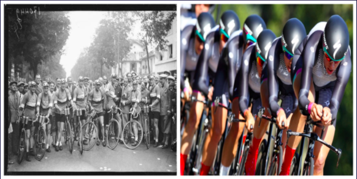
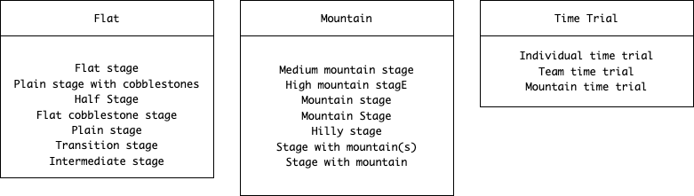

<style>
body {
text-align: justify}
</style>

```{r setup, include=FALSE}
knitr::opts_chunk$set(echo = TRUE,warning = FALSE)
```

## Country based analysis of Tour de France winners{.tabset}

### Introduction

```{r,message=FALSE,warning=FALSE}
library(stringr)
library(tidyr)
library(forcats)
library(dplyr)
library(countrycode)
library(ggplot2)
library(gridExtra)
tdf_winners <- readr::read_csv('https://raw.githubusercontent.com/rfordatascience/tidytuesday/master/data/2020/2020-04-07/tdf_winners.csv')
twind<-tdf_winners
#stage_data<-readr::read_csv('https://raw.githubusercontent.com/rfordatascience/tidytuesday/master/data/2020/2020-04-07/stage_data.csv')
#stad<-stage_data
tdf_stages<-readr::read_csv('https://raw.githubusercontent.com/rfordatascience/tidytuesday/master/data/2020/2020-04-07/tdf_stages.csv')
tstad<-tdf_stages
```

The Tour de France is a bike race initiated in 1903, running over 21 days or stages and with an average of 3,500 km raced by 160-180 riders. Our data covers three files containing winners from 100 races, 2200 stage winners, and riders of 22,000 riders across 109 races, at first glance it seemed all the data needed to do a thorough analysis was available.

```{r, echo=FALSE,out.width="50%", out.height="40%",fig.cap="$\\small{Figure}$ $\\small{1:}$ $\\small{Tour}$ $\\small{de}$ $\\small{France}$ $\\small{in}$ $\\small{the}$ $\\small{past}$ $\\small{Figure}$ $\\small{2:}$ $\\small{Tour}$ $\\small{de}$ $\\small{France}$ $\\small{in}$ $\\small{the}$ $\\small{present}$ ",fig.show='hold',fig.align='center'}

```


The Tour de France race was started as a fund raiser for a national French newspaper, printed on yellow paper, giving rise to the tour winning 'yellow jersey'. The data was selected from Alastair Rushworth's Data Package,it doesn't say how the data is collected, but given the age it is likely that the data may originate from the archives of the race which may belong to the newspaper.

Link for the data:
(https://github.com/rfordatascience/tidytuesday/blob/master/data/2020/2020-04-07/readme.md)

```{r, echo=FALSE,out.width="50%", out.height="40%",fig.cap="$\\small{Figure}$ $\\small{2:}$ $\\small{Tour}$ $\\small{de}$ $\\small{france}$ $\\small{in}$ $\\small{the}$ $\\small{present}$",fig.show='hold',fig.align='center'}
#knitr::include_graphics("new.png")
```

Given this race provenance in the hearts and minds of French people (see figure 1), this project investigates whether this nation's race is always won by Frenchmen and whether the nationality of riders has diversified as much as the equipment has (see figure 2) over the years.  

The race does indeed show that French riders have dominated both tours and tour or race stages and while the circuit has not changed so much in 100 years, the impact of worldwide travel, and worldwide advertising, not to mention substantial prize money has indeed increased the diversity of competition. It will be demonstrated in this report that countries other than France are emerging with coveted stage and tour winning riders, and that the Tour de France remains mainly a competition won (legitimately) by European riders. 


### Data Cleaning

Full data was available for Winners, Stage winners, and All riders files for 1903 to 2017, excluding the world war years. So, NA was added to the missing years i.e, from 1914 to 1918 (First World War) and from 1939 to 1945 (Second World War).  While winners and stages files had nationality, Winners contains country name with variable preceding spaces, Stage winners had country code which varied for some countries over the years (e.g. SUI and CHE for Switzerland). It was discovered there was no nationality for the all riders file and so previous riders were not included in our study.   

A new way was found to automatically convert country names to country codes, and this enabled a table join between winners and stage winners. Country codes were cleaned to establish a unique entry by country. This revealed some unusual data. Some tours had joint winners, so these were allocated to the most frequent winning country. As team time trial stages had no nationality these stages were not included. 

Stage names varied considerably during the life of the race (see figure 3) but that these fell into main categories of mountain, plain and time trial stages (with Mountain Time Trials converted to Time Trial category). Key words (Trial, Mountain, Hilly, and Flat) were used to identify super-categories, creating a new category column. This enabled a review of stage winners by their stage category and nationality.

```{r, echo=FALSE,out.width="80%", out.height="80%",fig.cap="$\\small{Figure}$ $\\small{3:}$ $\\small{Data}$ $\\small{split}$ $\\small{into}$ $\\small{different}$ $\\small{stage}$ $\\small{types}$",fig.show='hold',fig.align='center'}

```

While the tour circuit has not changed a lot in 100 years, tour speeds have improved but so has the equipment. The top prize is so coveted that the UCI had to introduce minimum bike constraints in 1999 to ensure that the equipment was not giving unfair advantage to riders. This year was chosen as the year from which to select recent races to establish a flat playing field over the last 20 years and to interpret whether diversity is occurring more recently among the winning riders. 

```{r,warning=FALSE,message=FALSE}
#Adding a new column Year to tdf_stages
tstad$Year <- as.numeric(str_sub(tstad$Date,1,4))
#tstad$Distance <- as.numeric(as.character(tstad$Distance))
# tie breaks given to the leading country
tstad$Winner_Country[1717]<-"BEL"
tstad$Winner_Country[1692]<-"FRA"
tstad$Winner_Country[1782]<-"FRA"
tstad$Winner_Country[2188]<-"FRA"
tstad$Winner_Country[1996]<-"BEL"
# Categorizing stages into flats, mountains or time trials 
stage_categorize <- tstad %>% group_by(Type) %>% summarise(ntype = n())
uniquetypes <- tolower(unique(tstad$Type))
# Grouping into time trials, mountain stages and flat stages
time_trials_types <- uniquetypes[str_detect(uniquetypes,"trial")]
not_timetrials_types <- setdiff(uniquetypes,time_trials_types)
mountain_types <- not_timetrials_types[str_detect(not_timetrials_types,"mountain") | str_detect(not_timetrials_types,"hilly")]
flat_types <- setdiff(not_timetrials_types, mountain_types)
# Adding new column Stage_category
tstad$Stage_category[tolower(tstad$Type) %in% mountain_types] <- "Mountain"
tstad$Stage_category[tolower(tstad$Type) %in% flat_types] <- "Flat"
tstad$Stage_category[tolower(tstad$Type) %in% time_trials_types] <- "Time trial"
tstad$Stage_category <- as.factor(tstad$Stage_category)
#Adding the missing years to tdf_winners
twind$Year <- as.numeric(str_sub(twind$start_date,1,4))
years_in_order <- data.frame(Year=seq(min(twind$Year), max(twind$Year), by=1))
winner_year_na <- merge(years_in_order, twind, all=TRUE)
#Converting the country code to country names in tdf_stages
twind$Nationality_Code<-countrycode(twind$nationality, origin = "country.name", destination = "iso3c",nomatch = NULL)
twind<- twind %>% mutate(Nationality_Code = ifelse(Nationality_Code=="DEU","GER",Nationality_Code))
twind<- twind %>% mutate(Nationality_Code = ifelse(Nationality_Code=="NLD","NED",Nationality_Code))
twind<- twind %>% mutate(Nationality_Code = ifelse(Nationality_Code=="CHE","SUI",Nationality_Code))
twind<- twind %>% mutate(Nationality_Code = ifelse(Nationality_Code=="DNK","DEN",Nationality_Code))
twind<- twind %>% mutate(Nationality_Code = ifelse(Nationality_Code=="IRL","IRE",Nationality_Code))
# Consolidating country codes in stage table
tstad<- tstad %>% mutate(Winner_Country = ifelse(Winner_Country=="DEU","GER",Winner_Country))
tstad<- tstad %>% mutate(Winner_Country = ifelse(Winner_Country=="NLD","NED",Winner_Country))
tstad<- tstad %>% mutate(Winner_Country = ifelse(Winner_Country=="CHE","SUI",Winner_Country))
tstad<- tstad %>% mutate(Winner_Country = ifelse(Winner_Country=="DNK","DEN",Winner_Country))
tstad<- tstad %>% mutate(Winner_Country = ifelse(Winner_Country=="IRL","IRE",Winner_Country))
tstad<- tstad %>% mutate(Winner_Country = ifelse(Winner_Country=="URS","RUS",Winner_Country))
tstad<- tstad %>% mutate(Winner_Country = ifelse(Winner_Country=="FRG","GER",Winner_Country))
tstad<- tstad %>% mutate(Winner_Country = ifelse(Winner_Country=="GDR","GER",Winner_Country))
```


### Analysis

#### Tour Overview 

It is no surprise that France has been the tour's greatest winner since 1903, as seen in the figure 4 below.  France has nearly double the wins in comparison to any other country. Belgium and Spain are the next nearest contenders with tour winning riders. This chart does show also that this race is won by very few countries, with many countries managing one win.

```{r,fig.cap="$\\small{Figure}$ $\\small{4:}$ $\\small{Winner}$ $\\small{countries}$ $\\small{over}$ $\\small{the}$ $\\small{years}$",fig.show='hold',fig.width=8,fig.height=4,fig.align='center',message=FALSE,warning=FALSE}
count_type_country<- tstad %>% group_by(Winner_Country, Stage_category) %>% summarise(count = n(),.groups = 'drop')
count_stage_country <- tstad %>% group_by(Winner_Country) %>% summarise(count = n(), .groups = 'drop') %>% arrange(desc(count))
count_type_country<-na.omit(count_type_country)
count_stage_country<-na.omit(count_stage_country)

count_winner_country<-  twind%>% group_by(nationality) %>% summarise(count = n()) %>% arrange(desc(count))
ggplot(data = count_winner_country) +
  geom_col(mapping = aes(x = reorder(nationality,-count), y = count), fill='gold1') +
  ggtitle('Winning Tour de France countries') + xlab('Countries') + ylab('Number of Wins')+
   theme(plot.title = element_text(hjust = 0.5), axis.text.x = element_text(angle = 45, hjust = 1))

```
The analysis of the overall tour winners was extended to include stage winners (figure 5). This demonstrates the same tendency, France dominates stage wins as well as tour wins. In terms of stage victories, France easily outperforms the competition. The next nearest stage winning nation is again Belgium, where a greater proportion of stage than tour wins emerges. Interesting points are that Italy is a better stage than tour competitor rising to third most successful on the stage chart compared to fourth on the win chart.


```{r,fig.cap="$\\small{Figure}$ $\\small{5:}$ $\\small{Comparison}$ $\\small{of}$ $\\small{stage}$ $\\small{winners}$ $\\small{and}$ $\\small{tour}$ $\\small{winners}$",fig.width=8,fig.height=4,fig.align='center',message=FALSE,warning=FALSE}
count_stage_country <- tstad %>% group_by(Winner_Country) %>% summarise(Stage_Wins = n()) %>% arrange(desc(Stage_Wins))
count_code_winner_country<-twind %>% group_by(Nationality_Code) %>% summarise(Tour_Wins = n()) %>% arrange(desc(Tour_Wins))
#count_stage_country<-filter(count_stage_country, Winner_Country != 'c(\"FRA\", \"FRA\")')
#count_stage_country<-filter(count_stage_country, Winner_Country != 'c(\"BEL\", \"BEL\")')
#count_stage_country<-filter(count_stage_country, Winner_Country != 'c(\"BEL\", \"GER\")')
count_code_winner_country<-  twind%>% group_by(Nationality_Code) %>% summarise(Tour_Wins = n()) %>% arrange(desc(Tour_Wins))
count_stage_country<-na.omit(count_stage_country)
count_code_winner_country<-na.omit(count_code_winner_country)
winners<-full_join(count_stage_country,count_code_winner_country,by=c("Winner_Country"="Nationality_Code"))

win <- tidyr::pivot_longer(winners, cols=c('Stage_Wins', 'Tour_Wins'), names_to='Wins', values_to="count")

ggplot(win, aes(x=reorder(Winner_Country,-count), y=count, fill=Wins)) +
   geom_bar(stat='identity', position='dodge')+
   ggtitle("Stage and Tour winning countries Tour de France")+ xlab('Countries') + ylab('Number of Wins')+
   theme(plot.title = element_text(hjust = 0.5), axis.text.x = element_text( angle=90,hjust = 1))
```
There are intriguing differences in Figure 5 for stage and tour wins. For example, despite having more stage wins than Spain, the Netherlands has less overall tour victories. As a result, it can be concluded that accumulating stage wins does not always imply there will be more tour wins. Spain won more tours than the Netherlands, while winning fewer stages. 

After closer examination of types of stage wins that countries were achieving (Figure 6), it was seen that countries with a lot of tour wins also win stages across all stage types. France won the most tours and stages, and their pattern of stage wins is proportional to the amount of stages available to win (there are more flat stages, then mountain stages, and time trials are the least frequent stages in the race history). At lower numbers of stage wins the stage type is difficult to see so a proportional plot is shown to the right of the proportion of stages countries win (looking only at countries with more than one stage win). 

It was possible to observe that there might be a pattern linking the types of stage wins to the country terrain, for example are more hilly countries giving rise to more mountain stage winners. The proportion graph shows which stage types each country dominated.

```{r,fig.cap="$\\small{Figure}$ $\\small{6:}$ $\\small{Details}$ $\\small{of}$ $\\small{Stage}$ $\\small{winners}$ $\\small{and}$ $\\small{their}$ $\\small{Stage}$ $\\small{types}$",fig.align='center',fig.width=10,fig.height=4,warning=FALSE,message=FALSE}

top20 <-count_stage_country[1:20,]

# removing single stage wins for clarity
count_type_country<-filter(count_type_country, Winner_Country !="CAN" & Winner_Country !="MEX" & Winner_Country !="LTU" & Winner_Country !="SLO" & Winner_Country != "BRA" & Winner_Country != "RSA"& Winner_Country != "SWE" & Winner_Country != "LAT"& Winner_Country != "UKR")

plot1 <- ggplot(data = subset(count_type_country,Winner_Country %in% top20$Winner_Country)) + 
  geom_col(aes(x = factor(Winner_Country, level = top20$Winner_Country), y = count, fill = Stage_category)) +
  ggtitle('Most Prolific Stage Winners') + xlab('Countries') + ylab('Number of Stage Wins') +
  labs(fill = 'Stage Type') + theme(plot.title = element_text(hjust = 0.5),axis.text.x = element_text(angle = 60, hjust = 1))
plot2 <- ggplot(data = subset(count_type_country,Winner_Country %in% top20$Winner_Country)) +
  geom_col(mapping =aes(x=factor(Winner_Country, level = top20$Winner_Country), y = count, fill =Stage_category),position = "fill") + 
  ggtitle('Stage type wins by country')+ ylab("Proportion of Stages won")+xlab("Countries")+labs(fill = 'Stage Type') +theme(plot.title = element_text(hjust = 0.5),axis.text.x = element_text(angle = 60,hjust = 1))
grid.arrange(plot1, plot2, nrow=1, ncol=2, widths =c(0.5,0.5))


```

Considering Spain and Netherlands again, it can be seen that Spain dominated more in the Mountain stages whereas Netherlands dominated more flat stages. This may be one of the reasons that the great cycling country of the Netherlands, don't appear as tour winners, being largely a flat country for cyclists they compete better on flat stages but not on mountain stages. Colombia is also noticeable as a nation winning more mountain stages. One surprising outcome is the USA picture as a prolific time trial winning nation, had this plot been in use it may have been possible to notice earlier that USA had such unusual stats that other investigations were worthwhile. These wins have since been disqualified due to drug misuse.

To look further into this effect stage wins were compared for all years by nationality, but with so much data the effects where difficult to see. To introduce a flat playing field over the recent years, data was filtered since 1999 (when the UCI introduced bike constraints). This showed which countries are emerging as tour winners or stage winners (Figure 7). Here it is shown that over the last 18 years (1999-2017) perhaps a different story is developing, as new countries emerge and some countries fall away.

```{r ,fig.cap="$\\small{Figure}$ $\\small{7:}$ $\\small{Comparison}$ $\\small{of}$ $\\small{stage}$ $\\small{winners}$ $\\small{and}$ $\\small{tour}$ $\\small{winners}$ $\\small{over}$ $\\small{recent}$ $\\small{years}$",fig.align='center',fig.width = 10,fig.height=4,message=FALSE,warning=FALSE}

count_stage_country_years <- tstad %>% group_by(Winner_Country,Year) %>% summarise(count = n(), .groups = 'drop') %>% arrange(desc(count))
recentwins<-filter(count_stage_country_years, Year> 1998)
recentwins<-na.omit(recentwins)

recentwins<-filter(recentwins, Winner_Country != "AUT" & Winner_Country != 'LTU' & Winner_Country != 'SLO'&Winner_Country != 'RSA' & Winner_Country != 'UKR' & Winner_Country != 'IRE')
plot3 <-ggplot(data = recentwins) + 
     geom_line(mapping = aes(x = Year, y = count, color=Winner_Country)) +
     ggtitle("Recent stage winning Tour de France countries")+
       facet_wrap(~Winner_Country, ncol=5)+ xlab('Years') + ylab('Number of Stage Wins')+
   theme(plot.title = element_text(hjust = 0.5), axis.text.x = element_text(angle = 60, hjust = 1))

count_year_sorted <- twind%>% group_by(Year, nationality) %>% summarise(count = n()) %>% arrange(desc(Year))

count_winner_recent <- subset(count_year_sorted[c(1:20),])

plot4<- ggplot(data = count_winner_recent) +
  geom_col(mapping = aes(x = fct_reorder(nationality,-count), y = count), fill='gold1') +
  ggtitle('Recent Winning Tour de France countries') + xlab('Countries') + ylab('Number of Tour Wins')+
   theme(plot.title = element_text(hjust = 0.5), axis.text.x = element_text(angle = 45, hjust = 1))
grid.arrange(plot3, plot4, nrow=1, ncol=2, widths =c(0.5,0.5))


```


The chart on the left, shows that the great dominating countries of France, Belgium, Spain and Italy, are showing either sporadic stage wins (France, Spain, Italy) or have fallen away (Belgium). You can see that the USA impact on the race was one period in time, and the work of one rider. It is also possible to see that Germany and Britain are emerging stage winners and possibly this makes them tour contenders, Slovakia and Norway may also be tour winning contenders.

Looking at the winner table on the right (Figure 7), it shows increased diversity and France no longer dominates the tour wins and the trend is changing, with some other countries moving up the rankings. Setting aside USA, as these wins were all disqualified, looking at wins by country over the recent years gives an appreciation of countries tending to win more recently. From this chart it is clear that Great Britain and Spain are showing an increasing ability to compete for the prize. Spain are the only nation from the all time tour winners to still compete in recent years, and could be considered the new dominating force in the tour.

This project could have been improved by enriching it with the analysis of the nationality of all competing riders, however this information is not available in these files or other widely available Tour de France files. If time had permitted, comparisons could have been made of the physical characteristics of tour winners by country over the years of the competition.


### Conclusion

In conclusion, while it seems like France would continue to dominate its home nation race, it may no longer be the case. Globalization has led to a more diversified Tour and resulted in a greater number of other European countries to moving up the rankings of total tour and stage wins. Based on our analysis, more wins could be expected from Britain and Spain, with Germany showing great stage winning presence, and perhaps also more Eastern European countries, such as Slovakia, emerging to take on the challenge of the tour. 

It is also possible to conclude that a country's geographical characteristics may lead to preferential outcomes in each stage type, as demonstrated by the examples of Spain and the Netherlands in the Mountain and Flat stage types respectively. It can be observed that the total number of stage wins are not necessarily directly linked to tour wins, and this may be due to the fact that the tour is not a race for countries to compete in but multi-nation teams compete for the top prize. It may be that team managers could look to this to select riders from different national terrains to make up their teams. 

It would be useful if this data set also included nationality of all riders to support extending this analysis. 


### Contribution

I, Kerry Ryder had primary responsibility for the material in joining data, some plots, text for the story, organisation for meetings, analysis of data.

I, Dennis Thomas Veliyath had primary responsibility for the material in data cleaning, production of submission file with all submission rules, organisation of some meetings to review project, text for the story.

I, Anush Harish had primary responsibility for the material in country code package to clean countries, data cleaning, some plots, analysis of data. 
